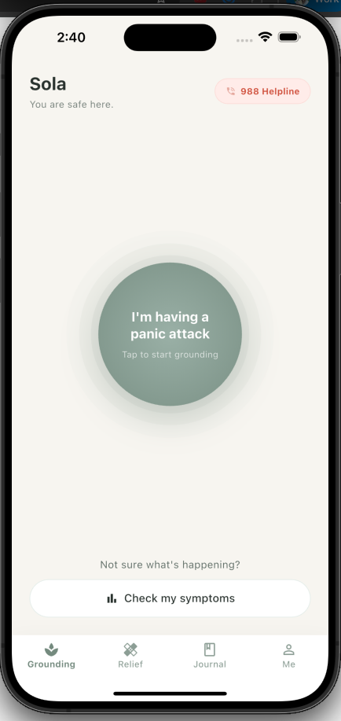
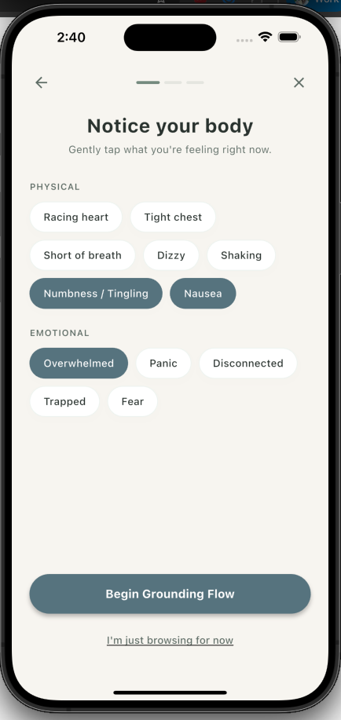
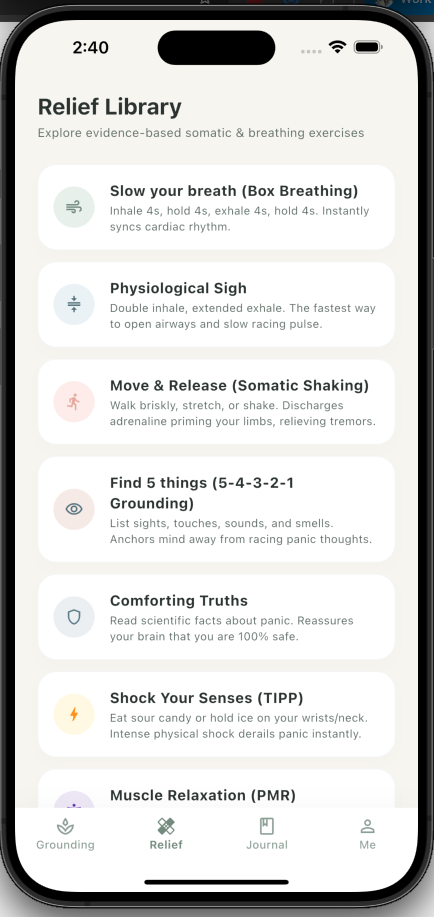
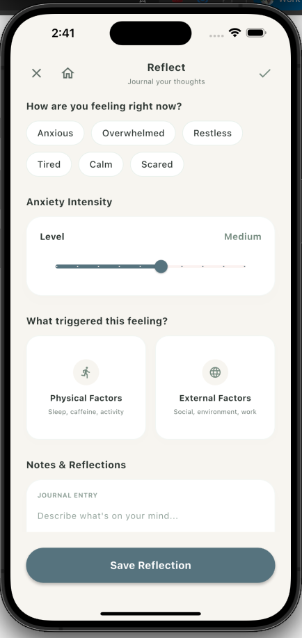

# 🌀 Sola: From Panic to Peace

**Sola** is a premium, evidence-based mental health and anxiety relief companion designed to guide users from acute panic to peaceful presence. Built in **Flutter**, Sola bridges the gap between **immediate crisis-moment de-escalation** and **long-term emotional resilience building**.

---

## 🏷️ The Brand: Why "Sola"?
The name **Sola** represents the three pillars of the app’s mission:
1. **Solace:** Serving as a quiet, safe sanctuary of comfort, consolation, and relief in moments of intense distress.
2. **Sol (Sun):** Symbolizing the warmth, light, and hope that return once the dark storm of panic clears.
3. **Solo:** Honoring the deeply personal, inward journey of self-reflection, self-care, and individual resilience.

---

## 💡 The Problem & The Solution

### The Problem
Anxiety and panic attacks are rising globally, yet in moments of high distress, most mental health apps fall short. They are either:
* **Cold & Clinical:** Sterile, medicalized interfaces that make the user feel like a patient rather than a person seeking comfort.
* **Cognitively Overwhelming:** Cluttered dashboards requiring heavy interaction when a user is in fight-or-flight mode and needs absolute simplicity.

### The Solution
Sola acts as a **somatic digital first-aid kit**. It uses HSL-tailored calming colors, organic visual breathing pacer rhythms, and clinically-validated grounding techniques to de-escalate panic attacks. Once calm, it transitions users into a private, local-first reflection space to track symptoms, record journals, and build lasting emotional habits.

---

## ✨ Core Features

### 🌪️ 1. Immediate Distress Relief (The Panic Button)
At the center of Sola's Home screen is a large, pulsing, comforting circle. Tapping **"I'm having a panic attack"** immediately enters a streamlined distress flow:
* **Symptom Diagnostics:** A low-cognitive-load checkbox grid where users select physical and emotional symptoms.
* **Smart Prioritized Routing:** Sola analyzes active symptoms in real-time to launch the single most effective exercise for the user's highest-risk symptom.

### 📚 2. Relief Library & Dynamic Curation Engine
Sola features an evidence-based somatic & breathing resource library. When browsed with active symptoms selected, Sola's **Dynamic Curation Engine** automatically groups and highlights exercises tailored to your exact physical and cognitive state:
* **For Respiratory Distress** (e.g., racing heart, chest tightness): Curates the **Physiological Sigh** (double-inhale, extended exhale to instantly trigger the parasympathetic nervous system) and **Box Breathing**.
* **For Somatic Tremors** (e.g., body shaking, numbness): Curates **Somatic Shaking** (brisk movements to safely discharge adrenaline pooling in limbs) and **Progressive Muscle Relaxation (PMR)**.
* **For Cognitive/Dissociative Symptoms** (e.g., racing thoughts, depersonalization): Curates **Sensory Shock / TIPP** (using intense physical sensations like holding ice or eating sour candy to ground the nervous system), **5-4-3-2-1 Grounding**, and **Comforting Truths**.

### ⏱️ 3. Gentle Check-in & Breathing Pacing
To prevent user fatigue and ensure clinical effectiveness, Sola's immersive breathing visualizers (Box Breathing and Physiological Sigh) implement an elegant check-in flow:
* **60-Second Focus:** Users breathe undisturbed for 60 seconds of paced breathing.
* **Empowered Dialogue:** After 60 seconds, the animation gently pauses, and a soft check-in dialog overlays the screen: *"How are you feeling now?"* 
  * Tap **"Keep Breathing"** to resume the peaceful loop.
  * Tap **"Ready to Reflect"** to transition to the journaling and reflection screen.

### 🤝 4. One-Tap Safe Circle
Reaching out during panic can feel impossible. Sola's **Safe Circle** allows users to pre-register trusted contacts and customize reassurance notes. With a single tap, they can alert their support circle that they need a check-in, without having to type a word.

### 🧠 5. Reassurance Hub
A dedicated resource explaining the science of panic. It features:
* **Calming Truths:** High-impact, swipable reminders reframing panic (e.g., *"Your heart is beating fast to protect you, not to hurt you"*).
* **Body Science Accordions:** Bite-sized, non-clinical explanations of what the body is doing during an adrenaline spike or hyperventilation, reinforcing that the user is 100% safe.

### 📊 6. Local-First Journaling & Mood Tracker
* **Interactive Check-ins:** Easily log daily anxiety levels, feelings, and factors (Physical or External) with animated selector states.
* **AI Grounding Companion:** A non-clinical, supportive writing companion that responds to your journal notes with grounding feedback, strictly avoiding medical diagnoses.
* **Constellation Gamification:** Completing reflections adds stars to your personal sky constellation, celebrating consistency without pressure.

---

## 📱 App Walkthrough & Media

### 🎥 Video Walkthrough (.webm / .mp4)
For a live, real-time look at Sola's fluid pacing transitions, organic breathing visualizers, and interactive state resets, watch our brief walkthrough:

<p align="center">
  <video src="assets/sola_walkthrough.mov" width="550" controls autoplay loop muted playsinline aria-label="Sola App Video Walkthrough: An interactive demonstration showing a user triggering an acute panic flow, selecting somatic symptoms, completing a paced physiological sigh breathing cycle, and logging their reflective journal entry to the history dashboard."></video>
</p>

> [!NOTE]
> **Accessibility / Screen Reader Transcript:** The video above showcases Sola's end-to-end panic de-escalation flow. It starts on the minimalist Home dashboard, clicks 'I'm having a panic attack', checks 'Racing Heart' and 'Overwhelmed' on the body scan screen, engages in 60 seconds of double-inhale breathing, and saves a written reflection which automatically navigates to the Journal history log showing the saved card.

### 🖼️ Feature Grid

<table border="0">
  <tr>
    <td width="25%" align="center">
      <p><b>1. Pulse Sanctuary</b></p>
      
    </td>
    <td width="25%" align="center">
      <p><b>2. Notice Your Body</b></p>
      
    </td>
    <td width="25%" align="center">
      <p><b>3. Relief Library</b></p>
      
    </td>
    <td width="25%" align="center">
      <p><b>4. Reflect & Journal</b></p>
      
    </td>
  </tr>
</table>

---

## 🎨 Design System & Aesthetics
Sola is built on a custom design system meticulously engineered to soothe the nervous system:
* **The Palette:** Built using **Muted Sage Greens** (associated with physical healing and tranquility) and **Slate Blues** (cognitive clarity and grounding) set against a warm, soft cream background.
* **Typography:** Modern, rounded, high-readability sans-serif styling to keep information clean and low-stress.
* **Micro-interactions:** Ultra-smooth transitions, organic scale transitions, and animated switchers prevent visual jarring.

---

## 💻 Tech Stack & Architecture
* **Frontend:** Cross-platform **Flutter** & **Dart**.
* **State Management:** A lightweight, reactive global state architecture (`SolaAppState` using `ChangeNotifier` and `ListenableBuilder`) designed to handle seamless navigation resets and persist session-level diagnostic variables.
* **Local Storage:** Designed for strict privacy; data is structured in clean JSON-ready schemas perfect for local-only, secure database adapters (such as Hive or SQLite).

---

## 🚀 Getting Started

### Prerequisites
* [Flutter SDK](https://docs.flutter.dev/get-started/install) (v3.13.0 or higher recommended)
* Dart SDK

### Installation & Run
1. **Clone the repository:**
   ```bash
   git clone https://github.com/conooi/sola-app.git
   cd sola-app
   ```
2. **Resolve packages & dependencies:**
   ```bash
   flutter pub get
   ```
3. **Run the application:**
   ```bash
   flutter run
   ```
